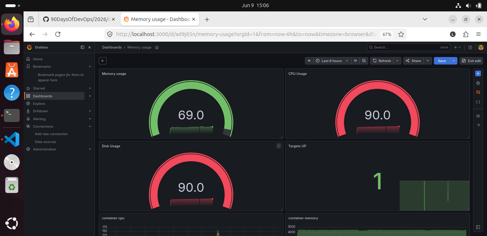
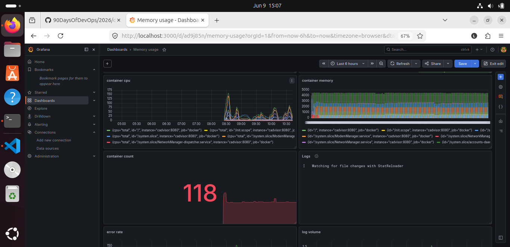
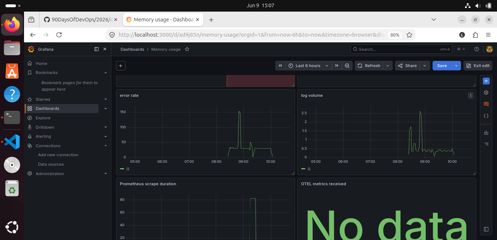

# 📌 Observability Stack for DevOps (Prometheus + Grafana + Loki + Tempo + OpenTelemetry)

## 📌 Overview

This project implements a complete **cloud-native observability system** for monitoring, logging, and tracing containerized applications using industry-standard DevOps tools.

It provides a unified observability platform based on the **three pillars of observability**:

* 📊 **Metrics** → Prometheus
* 📄 **Logs** → Loki + Promtail
* 🔍 **Traces** → Tempo + OpenTelemetry
* 📈 **Visualization** → Grafana

---

## 🏗️ Architecture

```text
Application
   │
   ▼
OpenTelemetry Collector
   ├── Metrics → Prometheus → Grafana
   ├── Logs → Loki → Grafana
   └── Traces → Tempo → Grafana

Supporting Components:
- Node Exporter → Host-level metrics
- cAdvisor → Container-level metrics
```

---

## 🛠️ Tech Stack

* Docker
* Docker Compose
* Prometheus
* Grafana
* Loki
* Promtail
* Tempo
* OpenTelemetry Collector
* Node Exporter
* cAdvisor

---

## 🎯 Features

* Centralized logging using Loki + Promtail
* Real-time metrics monitoring using Prometheus
* Distributed tracing using Tempo + OpenTelemetry
* Unified dashboards using Grafana
* Container-level monitoring using cAdvisor
* Host-level monitoring using Node Exporter
* Fully containerized observability stack using Docker Compose

---

## 🚀 How to Run

```bash
git clone https://github.com/Lingaraj-1/observability-stack-monitoring.git
cd observability-stack-monitoring
docker-compose up -d
```

---

## 🌐 Access Services

| Service    | URL                   |
| ---------- | --------------------- |
| Grafana    | http://localhost:3000 |
| Prometheus | http://localhost:9090 |

---

## 📊 Dashboards

The following dashboards are available in Grafana:

* Infrastructure Monitoring Dashboard
* Logs Dashboard (Loki)
* Distributed Tracing Dashboard (Tempo)
* Prometheus Targets & Metrics

---

## 📁 Project Structure

```text
.
├── docker-compose.yml
├── prometheus/
├── grafana/
├── loki/
├── promtail/
├── otel-collector/
├── notes-app/
└── screenshots/
```

---

## 📸 Screenshots

### 🖥️ Host Metrics Dashboard



---

### 📦 Container Metrics Dashboard



---

### 💾 Volume Metrics Dashboard



---

## 💡 Key Learnings

* Built an end-to-end observability pipeline for cloud-native systems
* Integrated metrics, logs, and traces into a single platform
* Implemented OpenTelemetry-based distributed tracing
* Designed a production-like DevOps monitoring architecture
* Improved debugging and troubleshooting using centralized observability
* Gained hands-on experience with modern SRE and DevOps observability tools

---

## 👨‍💻 Author

**Lingaraj Hottiyavar**

DevOps Engineer | Cloud & Observability Enthusiast

